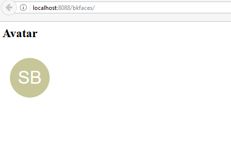

"# bkfaces"
# 
# bkfaces 
JSF component avatar like gmail
after add mvn install to local repository you can use this taglib for use avatar
xmlns:bk="http://www.bkfaces.org/ui"
after simple tag
## Usage
```xhtml
  <bk:avatar value="SB"  />
